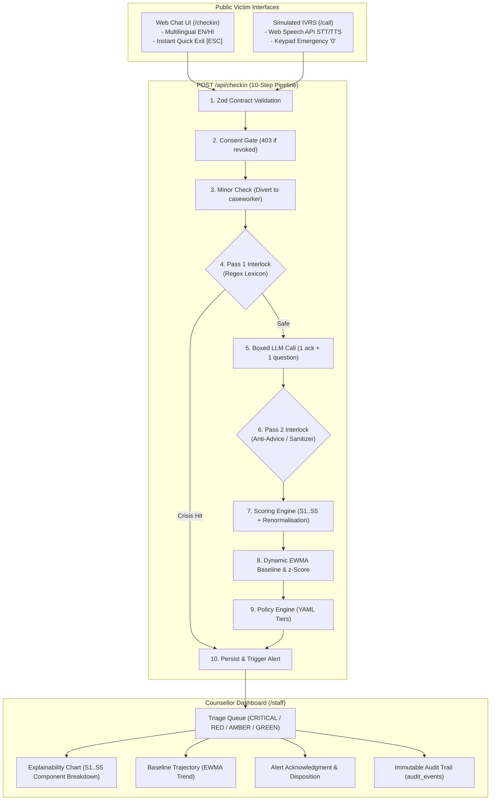

# Project SAHARA

> **AI-Powered Dynamic Mental Health Monitoring & Distress Prediction System for Victims of Atrocities**  
> *Ministry of Social Justice and Empowerment — Smart India Hackathon (SIH 26094)*

[-black?style=flat-square&logo=next.js)](https://nextjs.org/)
[](https://react.dev/)
[](https://www.typescriptlang.org/)
[](https://tailwindcss.com/)
[-3ECF8E?style=flat-square&logo=supabase)](https://supabase.com/)
[](tests/)
[](types/contract.ts)
[](lib/i18n/)

---

## 📌 Executive Summary

### The Core Problem
Under the Scheduled Castes and Scheduled Tribes (Prevention of Atrocities) Act 1989 and Bharatiya Nyaya Sanhita (BNS), victims experience severe, prolonged psychological distress **after** registering a complaint. Traumatic triggers persist for months or years:
* Bail release of the accused
* Intimidation and community pressure
* Repeated court adjournments and delays
* Overdue statutory relief compensation
* Social boycott and economic displacement

Current institutional mechanisms provide legal and financial aid, but **nobody monitors ongoing psychological wellbeing**. A court records an adjournment; a helpline logs that a call ended. Nothing connects case events to whether a victim is surviving the ordeal.

### The Governing Principle
> **"The AI does not decide. It decides who a human looks at next, and why."**

SAHARA is **not an autonomous clinical agent** and **not a therapist bot**. It is an **explainable monitoring and triage layer** that continuously tracks distress across check-ins and court docket milestones, ranking human counsellors' review queues with complete explainability.

---

## ⚡ The Breakthrough: $S_3$ Case Context Dominance

Most mental health systems try to parse emotion from voice tone or free-form text. In marginalized, rural populations, this approach fails:
1. **Acoustic and NLP bias:** Emotion inference degrades dramatically across accents, regional dialects, gender, and inexpensive smartphone microphones.
2. **Ignores real-world stressors:** The primary causes of acute distress in atrocity cases are **already documented in court dockets and calendars**:
   * *Is a court hearing scheduled within the next 7 days?*
   * *Has the accused been released on bail?*
   * *Is government relief compensation >30 days overdue?*
   * *Was an intimidation report filed recently?*
   * *Have there been 3 or more adjournments?*

SAHARA computes the **$S_3$ Case Context Signal** directly from docket data and today's date — requiring zero NLP, zero acoustic inference, and zero ML training data. It is dialect-proof, deterministic, and instantly explainable.

---

## 🏛️ System Architecture



---

## 📐 Explainable Scoring Engine

Instead of an opaque black-box neural classifier, SAHARA uses an **additive, mathematically inspectable formula**:

$$\text{Composite} = 0.35 \cdot S_1 + 0.25 \cdot S_2 + 0.25 \cdot S_3 + 0.15 \cdot S_4 + 0.00 \cdot S_5$$

| Signal | Component | Weight | Source | Description / Logic |
|:---:|---|:---:|---|---|
| **$S_1$** | **Self-Report** | **0.35** | User input (3 questions, 0–4 scale) | Normalized 0–100. If Question 3 (*"Do you feel safe right now?"*) is answered **No (4)**, immediately triggers deterministic **CRITICAL**. |
| **$S_2$** | **Linguistic Distress** | **0.25** | Boxed LLM Adapter | Distress score (0–100) extracted from transcript. If LLM fails or times out, safely yields `null` (never defaults to 0). |
| **$S_3$** | **Case Context** | **0.25** | Court docket & calendar | **Dominant external signal.** Calculated deterministically from case milestones (see rubric below). |
| **$S_4$** | **Engagement Monotonicity** | **0.15** | System interaction patterns | Monotonically non-decreasing: $+25$ per missed check-in, $+20$ for mid-flow abandonment. **Silence never reduces distress score.** |
| **$S_5$** | **Acoustic Metric** | **0.00** | Speech paralinguistics | **Pinned to 0.00 weight by policy.** Displayed with a low-confidence disclaimer to eliminate dialect/accent discrimination. |

### $S_3$ Case Context Rubric
$$S_3 = \min\left(100, \sum \text{applicable condition points}\right)$$

* **$+25$ pts:** Intimidation report filed within the last 14 days *(Time-windowed)*
* **$+20$ pts:** Accused released on bail *(Standing)*
* **$+15$ pts:** Next court hearing within 7 days *(Time-windowed)*
* **$+15$ pts:** Statutory relief compensation overdue $>30$ days *(Standing)*
* **$+10$ pts:** Adjournment count $\ge 3$ *(Standing)*
* **$+10$ pts:** Active social boycott in village *(Standing)*
* **$+5$ pts:** Case pending for $>365$ days *(Standing)*

### Missing-Signal Renormalisation
When optional components ($S_1$ or $S_2$) are omitted or unavailable:
$$W_{\text{effective}, k} = \frac{W_k}{\sum_{j \in \text{present}} W_j}, \quad \text{Composite} = \sum_{k \in \text{present}} (W_{\text{effective}, k} \cdot S_k)$$
> **Invariant: Missing $\neq$ Calm.** An omitted response never defaults to zero, preventing disengaged victims from appearing artificially calm.

---

## 📈 Dynamic Per-Person Baselines (EWMA & Change Points)

Fixed thresholds systematically fail: they over-alert on naturally expressive individuals and miss subtle, life-threatening shifts in stoic individuals.

SAHARA builds an **Exponentially Weighted Moving Average (EWMA)** baseline $(\mu_t, \sigma_t^2)$ for each person:

1. **Calculate $z$-Score** (*strictly before updating the running baseline*):
   $$z_t = \frac{x_t - \mu_{t-1}}{\max(\sigma_{t-1}, 8)}$$
2. **Update Baseline Mean and Variance** ($\lambda = 0.3$, noise floor $\sigma = 8$):
   $$\mu_t = 0.3 \cdot x_t + 0.7 \cdot \mu_{t-1}$$
   $$\sigma_t^2 = 0.3 \cdot (x_t - \mu_{t-1})^2 + 0.7 \cdot \sigma_{t-1}^2$$
3. **Change Point Flag:**
   $$\text{Change Point} = (z_t > 2.0) \land (\text{History} \ge 2)$$

A change point alerts counsellors to a **statistically significant personal deviation**, regardless of whether their absolute composite score crossed an arbitrary threshold.

---

## 🛡️ Safety Architecture & Ethical Invariants

```
               [ User Input / Audio Transcript ]
                               │
                               ▼
               ┌───────────────────────────────┐
               │    PASS 1: REGEX INTERLOCK    │
               │  40 Phrases (EN / HI / ROM)   │
               └───────────────┬───────────────┘
                               │
                 ┌─────────────┴─────────────┐
                 │                           │
          [ Lexicon Match ]            [ Clean Input ]
                 │                           │
                 ▼                           ▼
      ┌─────────────────────┐    ┌─────────────────────┐
      │ Escalate CRITICAL   │    │ Boxed LLM Adapter   │
      │ - LLM Bypassed      │    │ - 1 Ack + 1 Quest.  │
      │ - Return Hotlines   │    │ - Extract S2 Score  │
      │ - Immediate SLA     │    └───────────┬─────────┘
      └─────────────────────┘                │
                                             ▼
                                 ┌───────────────────────┐
                                 │ PASS 2: LLM SANITIZER │
                                 │ Reject Advice/Promises│
                                 └───────────┬───────────┘
                                             │
                                   [ Validated Response ]
```

1. **Deterministic Crisis Detection (Pass 1):** Regex matching across 40 verified crisis markers in English, Hindi (Devanagari), and Roman Hindi (Hinglish). Crisis detection is code, not prompt engineering.
2. **Safe-Fail Negation Handling:** Even negated crisis phrases (*"I am not suicidal"*) fire the safety interlock. In crisis triage, false alarms are safe; missed crises are fatal.
3. **Boxed LLM & Output Sanitization (Pass 2):** The LLM is confined to acknowledging feelings in one sentence and asking one follow-up question. Pass 2 rejects any clinical advice, medical diagnoses, false reassurances (*"everything will be fine"*), legal promises, messages $>320$ characters, or $>1$ question mark, replacing them with vetted static bank responses.
4. **Zero Personal Identifiable Information (PII):** Pseudonymous synthetic IDs only (`A-XXXX`). No names, telephone numbers, Aadhaar numbers, or court case numbers in the database.
5. **Mandatory Consent Gate:** Evaluated at the top of `/api/checkin`. If active consent is absent or withdrawn, the API returns `403 Forbidden` with zero database writes.
6. **Minor Safeguarding:** Any check-in marked with a minor flag halts automated scoring and diverts directly to a human caseworker workflow.
7. **Database Isolation & Audit Trail:** Supabase PostgreSQL with strict Row Level Security (RLS) and zero public access policies. Every counsellor review of victim data writes an immutable audit record in `audit_events`.

---

## 🖥️ Application Tour

| Route | Interface | Purpose |
|---|---|---|
| [`/`](app/page.tsx) | **Public Portal** | Multilingual landing page with emotional support pathways, integrated 4-7-8 breathing tool, crisis helpline modal, and instant **Quick Exit [ESC]** redirecting to weather.com. |
| [`/checkin`](app/checkin/page.tsx) | **Interactive Chat Check-in** | Low-bandwidth text check-in featuring 3 structured self-report questions ($S_1$) and open distress reflection ($S_2$). |
| [`/call`](app/call/page.tsx) | **Simulated Voice IVRS** | Voice interface leveraging Web Speech API (STT & TTS) with keypad dialer, real-time voice synthesis, and emergency **'0' key handoff**. |
| [`/staff`](app/staff/page.tsx) | **Counsellor Triage Dashboard** | Secure dashboard ranking cases by Tier (`CRITICAL`, `RED`, `AMBER`, `GREEN`), change-point anomaly flags, and SLA countdown timers. |
| [`/staff/[personId]`](app/staff/[personId]/page.tsx) | **Case Explainability View** | Detailed view displaying additive $S_1..S_5$ breakdown, personal EWMA baseline trajectory, court docket milestones, and alert acknowledgment modal. |
| [`/guide`](app/guide/page.tsx) | **SIH Interactive Guide & Testbench** | Live presentation slide deck, technical manual, interactive persona selector, and real-time regex crisis lexicon playground. |

---

## 🎭 The Golden Path Demo (Persona A-4471)

Demonstrate the system live in **90 seconds**:

* **Persona:** `A-4471` (Land dispossession, trial stage, Hindi).
* **Baseline Pressure:** Accused out on bail (+20), relief compensation 62 days overdue (+15), 4 court adjournments (+10), case open 400 days (+5) = **$S_3 = 50$ standing points**. Personal baseline $\mu = 28.90$.
* **Day 0 Stressor:** An intimidation report is filed yesterday (+25), and a court hearing is scheduled in 6 days (+15) $\to$ **$S_3$ spikes from 50 to 90**.
* **Victim Check-in:** Victim reports moderate distress ($S_1 = 50$, $S_2 = 55$).
* **System Calculation:**
  $$\text{Composite} = (0.35 \times 50) + (0.25 \times 55) + (0.25 \times 90) + (0.15 \times 0) = 53.75$$
  $$z = \frac{53.75 - 28.90}{\max(1.64, 8)} = \frac{24.85}{8} = 3.11 \implies \mathbf{Change\ Point\ Triggered!}$$
* **Outcome:** Policy assigns **RED Tier** (SLA 30 minutes, mandatory counsellor acknowledgment) **6 days before the court date even occurs**.

---

## 🚀 Quick Start Guide

### Prerequisites
* **Node.js**: v20.x or higher
* **npm**: v10.x or higher

### 1. Installation
```bash
git clone https://github.com/somenathjana21-ops/Sahara-Re.git
cd Sahara-Re
npm install
```

### 2. Environment Configuration
Create a `.env.local` file in the root directory:
```bash
cp .env.example .env.local
```

Configure the environment variables:
```env
# Required for persistent cloud database (optional for local in-memory tests)
SUPABASE_URL=https://your-project.supabase.co
SUPABASE_SERVICE_ROLE_KEY=your-service-role-key

# LLM Provider: mock | groq | openrouter | gemini | ollama | none
LLM_PROVIDER=mock
LLM_API_KEY=
LLM_MODEL=

# Staff Authentication (Required for accessing /staff dashboard)
STAFF_PASSCODE=sahara2026
SESSION_SECRET=sahara2026

# Timezone (Required for date calculations)
PROJECT_TZ=Asia/Kolkata
```

> 💡 **Tip:** SAHARA defaults to `LLM_PROVIDER=mock` and includes an in-memory repository for instant, zero-setup local testing!

### 3. Run Development Server
```bash
npm run dev
```
Open [http://localhost:3000](http://localhost:3000) in your browser.

* Public Check-in: `http://localhost:3000/checkin`
* Simulated Call: `http://localhost:3000/call`
* Counsellor Dashboard: `http://localhost:3000/staff` (Passcode: `sahara2026`)
* Interactive Guide & Testbench: `http://localhost:3000/guide`

### 4. Seed Database (Optional)
If using Supabase, populate demo personas and historical check-ins:
```bash
npm run seed
```

---

## 🧪 Testing & Verification

SAHARA features an extensive native test suite with **171 automated tests** covering mathematical formulas, safety interlocks, contract schemas, and API pipelines.

```bash
# Run all 171 tests
npm test

# Run a specific test suite (e.g., safety interlock)
npm test -- safety

# Run scoring engine tests
npm test -- scoring

# Run full pipeline integration tests
npm test -- pipeline

# Strict TypeScript typechecking (zero errors required)
npm run typecheck
```

---

## ⚙️ Environment Variables Reference

| Variable | Required | Default | Description |
|---|:---:|:---:|---|
| `STAFF_PASSCODE` | **Yes** | — | Passcode required to unlock the `/staff` counsellor triage dashboard. |
| `PROJECT_TZ` | **Yes** | `Asia/Kolkata` | Timezone used for court hearing and intimidation time-window calculations. |
| `LLM_PROVIDER` | No | `mock` | LLM adapter backend: `mock`, `groq`, `openrouter`, `gemini`, `ollama`, or `none`. |
| `LLM_API_KEY` | Conditional | — | API key for Groq / OpenRouter / Gemini (not required for `mock` or `ollama`). |
| `LLM_MODEL` | No | Provider default | Model identifier (e.g. `llama-3.3-70b-versatile`, `gemini-1.5-flash`). |
| `SUPABASE_URL` | Optional | — | URL of your Supabase instance for persistent storage. |
| `SUPABASE_SERVICE_ROLE_KEY` | Optional | — | Supabase service-role secret key (bypasses RLS server-side). |
| `SESSION_SECRET` | No | `STAFF_PASSCODE` | HMAC signing secret for counsellor session tokens. |

---

## 📁 Repository Directory Structure

```text
sahara-re/
├── app/                          # Next.js 15 App Router
│   ├── api/                      # Backend API Route Handlers
│   │   ├── checkin/route.ts      # 10-step unified ingestion pipeline
│   │   ├── staff/                # Staff auth, queue, person detail, audit APIs
│   │   ├── alerts/               # Alert queries and acknowledgment
│   │   └── consent/              # Consent grant and revocation
│   ├── checkin/page.tsx          # Public multilingual text chat UI
│   ├── call/page.tsx             # Simulated voice IVRS UI (Web Speech API)
│   ├── staff/                    # Counsellor dashboard & explainability views
│   ├── guide/page.tsx            # Interactive SIH guide, presentation & testbench
│   └── page.tsx                  # Public home portal
├── components/                   # React Components
│   ├── common/                   # BreathingWidget, QuickExit, CrisisHelplinesModal
│   └── staff/                    # ExplainabilityChart, TrendChart, AckModal, StaffAuthGate
├── lib/                          # Core Logic & Engines
│   ├── scoring/                  # s1.ts, s2.ts, s3.ts, s4.ts, s5.ts, composite.ts, baseline.ts
│   ├── safety/                   # lexicon.ts (40 crisis phrases), interlock.ts, replies.ts
│   ├── policy/                   # YAML evaluation engine
│   ├── llm/                      # Swappable adapter (Mock, Groq, OpenRouter, Gemini, Ollama)
│   ├── db/                       # Supabase client & in-memory test repository
│   └── i18n/                     # Bilingual Hindi & English language context
├── policy/
│   └── v1.yaml                   # Versioned policy configuration (weights, thresholds, SLAs)
├── types/
│   └── contract.ts               # Frozen Zod schemas for contracts, databases & APIs
├── scripts/                      # Utility & automation scripts
│   ├── fixtures.ts               # Synthetic personas (A-4471, A-6218, A-2301, A-7892)
│   ├── seed.ts                   # Supabase database seeder
│   └── test-runner.ts            # Native node:test discovery runner
├── tests/                        # 171 automated tests across 39 suites
├── docs/                         # Detailed architecture & SIH project brief
└── public/                       # Static media, icons & presentation slides
```

---

## ⚖️ Legal & Regulatory Alignment

* **Scheduled Castes and the Scheduled Tribes (Prevention of Atrocities) Act 1989 & Rules:** Aligned with statutory rehabilitation, relief compensation milestones, and victim protection standards.
* **Digital Personal Data Protection Act (DPDP) 2023:** Enforces data minimization, purpose limitation, zero PII storage, and verifiable consent gates.
* **Section 228A IPC / BNS:** Strict legal prohibition on disclosing victim identity; enforced via pseudonymization (`A-XXXX`).
* **Emergency Hotlines:** Direct integration and referral to official 24/7 Indian hotlines: **Tele-MANAS (14416 / 1800-891-4416)** and **KIRAN (1800-599-0019)**.

---

## 🤝 Contributing & Community

Contributions, bug reports, and suggestions are welcome!
1. Fork the repository.
2. Create a feature branch (`git checkout -b feature/improvement`).
3. Commit your changes (`git commit -m "Add feature"`).
4. Run tests and typecheck (`npm test && npm run typecheck`).
5. Open a Pull Request.

---

## 📄 License

This project is developed for the **Smart India Hackathon (SIH 26094)** under the Ministry of Social Justice and Empowerment problem statement. Released under the [MIT License](LICENSE).
